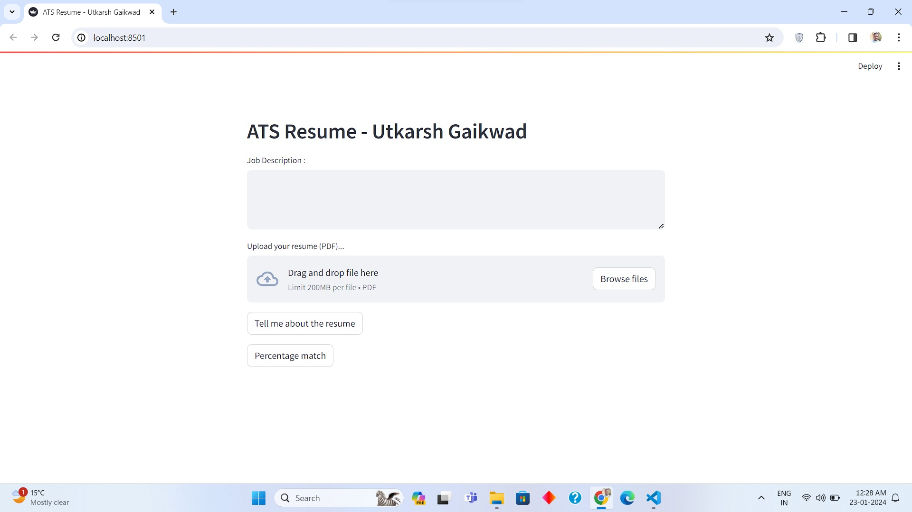
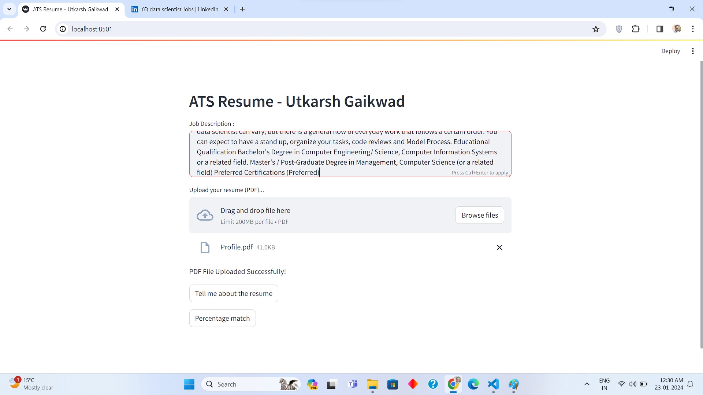
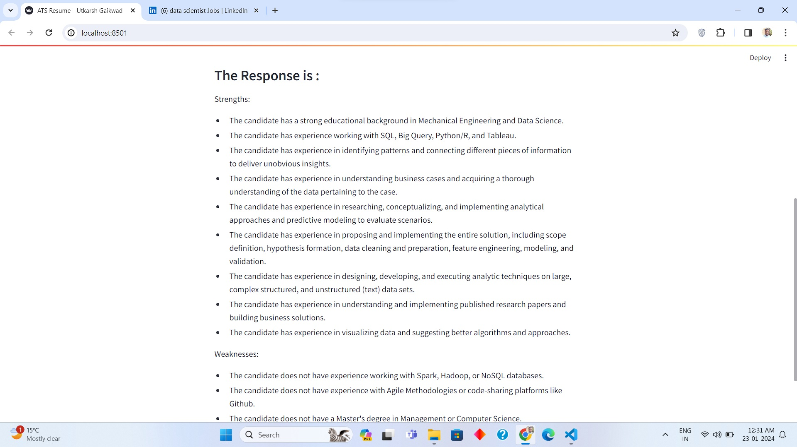

# Resume-ATS
This is an Resume ATS tracking system developed using Google Gemini Pro.

# Streamlit application link
Link of streamlit deployment : [https://resume-ats-utkarsh-gaikwad.streamlit.app/](https://resume-ats-utkarsh-gaikwad.streamlit.app/)

# How to run this app
In VS Code type below command
~~~cmd 
streamlit run app.py
~~~

# User Interface of the application

# Add the Job Description from linkedin and upload the resume

# Resume summarry strengths and weakness after pressing tell me about resume

# Resume matching percentage after pressing button percentage match
